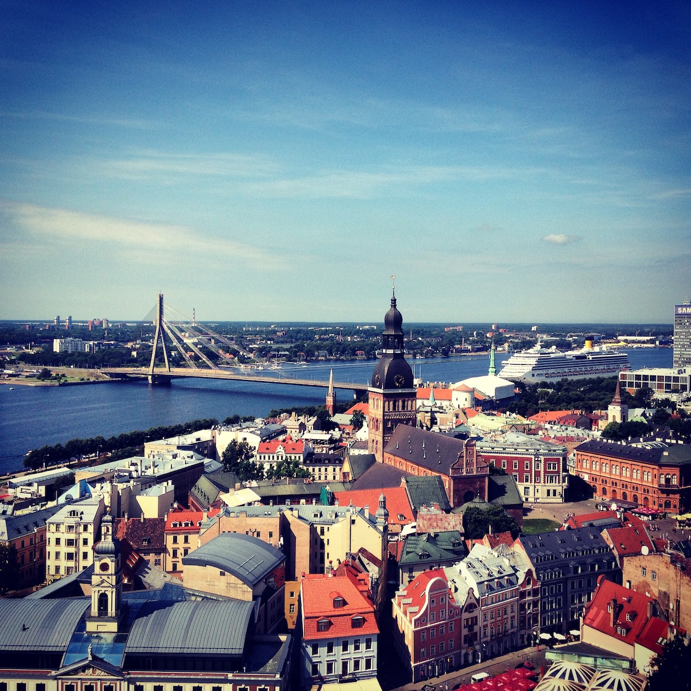
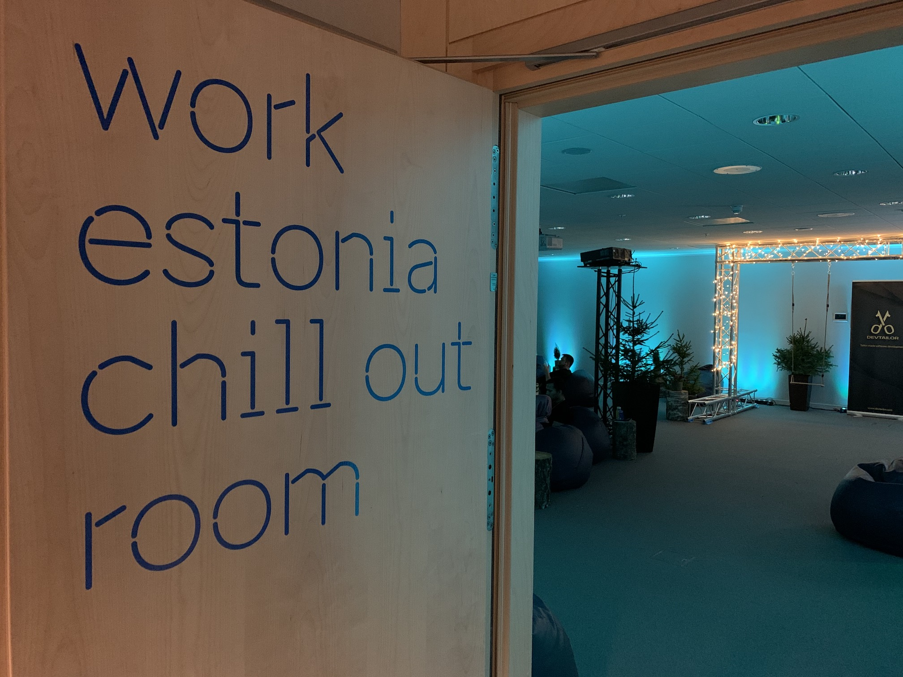
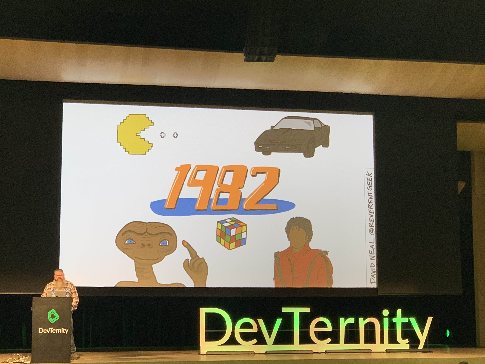

This one particular conference, this particular year, was something different and special to me. The thing is, it’s the fifth [DevTernity](https://devternity.com) that I’m attending, but it’s the first one where I’m not [part of the organizing team](/how-organizing-meetup-changed-my-life). After four years of challenging organization process, I decided to follow some other goals this year and attended as a regular unbias visitor. And oh boy, I enjoyed it so much!

### City

DevTernity was born and is being held in Riga for five years now. It so just happened that it’s also my hometown where I was born and lived for 27 years until [relocating to Tallinn](/moving-to-estonia-for-introverts-1). That’s why it’s pretty hard to evaluate the city from a regular tourist/visitor perspective.

> _It's possible to find nice views in Riga_

It has all that is needed for some proper tourist evenings that we normally get when attending conferences - romantic Old Town, a few cozy places for food and drinks, some nice views. It definitely will have enough content for any tourist for a few days or so. But Latvia is not just about Riga. It’s also about [nature](https://www.latvia.eu/natural-attractions), and I tend to enjoy it much more compared to this small, but rather crowded city. If you have free time, I recommend spending some part of it exploring other country parts.

### Venue

[National Library of Latvia](http://ture.lnb.lv/en.html) is the traditional venue that hosts DevTernity for five years already. It’s a relatively new building for Riga, which is easy to notice if you are visiting Old Town and have a walk near the Daugava river. It’s a modern building that has everything needed for a top-class conference.

It’s very neat that a lot of weird restrictions that prevented making the conference better were loosened this year, which made pretty important activities like lunch and afterparty much better organized and relaxed. Technical equipment like sound, video, and lights were top-notch thanks to the professional team and well-organized collaboration.

> _Work Estonia Chill Out Room is a tradition now. Such a nice place to chill and recharge in silence!_

### Activities

DevTernity is positioned as an intense conference that is focused on content and pure knowledge value, so the only provided activity was afterparty that happened in the same venue. Afterparty had a pleasant vibe and I was able to chat with some people that I haven’t seen for a long time.

> _Legally hanging around with a beer at the National Library that is all about the rules and traditions is a next level!_

I liked this afterparty much more compared to previous years because it didn’t require any additional transportation and the whole space was open, which meant that it’s easy to navigate and simply walk around and chat with random people. Before, it usually turned into everyone sitting in small groups without any way to join them, because all seats were taken. I hope that the same format will be kept for the next year as well.

### Catering

Catering was well-handled this year. I didn’t have to wait in long queues and it was a convenient process. Overall lunch quality was good. It was also great that both healthy and not-so-healthy snacks were accessible at any time to keep visitors’ energy level high. And this year, two sponsors offered free coffee, together with additional drinks served by organizers and some other sponsors. It’s cool that lactose-free milk has been provided by organizers (unfortunately coffee-serving sponsors didn’t take care of that).

### Content

But all the above is not that important, to be honest. Content is what made it the best conference I ever attended! DevTernity is all about the content. Pure, distilled value that is injected into you every hour. Rockstar speakers, like Kevlin Henney, Scott Hanselman, David Neal and others (to be honest, they all are rockstars!), shared their experience, wisdom, and motivation from three parallel tracks. I struggled to decide where to go sometimes and definitely will be watching videos for some content that I have missed.

> _David Neal had just perfect hand-drawn slides <3_

Being more and more interested and involved in not only development but also leadership and building teams, I found this year talks extremely valuable and resonating with my current thoughts and challenges. I mostly attended the first track, which had the biggest capacity and the spiciest talks in my opinion. I enjoyed the balance between tech. and soft skill/growth talks. Because there is no focus on particular technology or tool for the majority of talks, but more on personal or team growth and craftsmanship, content is suited for everyone, which is a huge benefit.

It’s hard to imagine any other conference in Riga to gather this amount of gold speakers under the same roof, and the motivational charge the one can get during the talks is skyrocketing. Since all talks are long and breaks between them are relatively short, the one conference day turns into a non-stop action that makes you both tired and happy at the same time. I tend to compare this year’s DevTernity with high-quality training at the gym - you feel exhausted in the end, but the benefit and dopamine level makes you feel soo damn good anyway! I never had so many notes from the conference, and I still feel this energy charge I got during this one day.

Here is my list of TOP-5 talks in no particular order (I will add links to videos once they are published):

- **Roy Osherove** - The Coaching Architect Manifesto
- **David Neal** - Leadership Guide for the Reluctant Leader
- **Scott Hanselman** - Scaling Yourself
- **Kevlin Henney** - Lean code
- **J.B. Rainsberger** - The Well-Balanced Programmer

### People

I was amazed by how diverse the crowd was this year. It felt that people from all over the world joined this time, and after some chats with the team I found out that tickets were sold out so fast that a lot of locals didn’t get a chance to attend. Overall it felt that this contributed to the fact that the crowd felt quite chill, friendly and self-organized. Energy level during the talks and even in Slack was moderately high and I never had to feel my regular empathic embarrassment due to the overall audience being silent or inactive when not needed.

### Key takeaways

- The self-organizing team knows how to handle unknown situations when the lead person is absent…
- … so a leader should challenge people to start thinking of what to do when they don't know what to do.
- 10x dev is the one who can teach 10 people around, not the one who knows “full-stack”
- “Life is too short to let things stay the way they are”.
- Every conflict is always good guy vs. good guy, not good guy vs. bad guy.
- We don't know our capacity and spend time on useless crap a lot. Knowing your capacity and not letting yourself be overloaded with work leads to great achievements.
- 2-minute rule - if something takes you 2 minutes or less, do it right now instead of postponing it.
- We all have a limited amount of keystrokes(or any way to express ourselves) left in our lives. Try not to waste them, share useful information and ditch social media distractions.
- You only need one person reading your blog to double your keystrokes.

The last one hit me hard. I did overcome my internal fears some time ago and started writing texts to share with others without much caring how many people will read them. But hitting 50 or 100 reads is already amazing! And when some posts hit more than 2k reads, just trying to imagine a room full of 2000 people that you potentially helped or motivated somehow makes me feel pumped.

Only one other person reading your text will indeed double your keystrokes spent to write it, so don’t be afraid and share your thoughts and ideas with others!

### Conclusion

As I said, it was pretty hard for me to evaluate DevTernity this year. I have invested my time and energy into making it happen for the previous four years, so I went there fearing that in the end, I will regret my choice. I can say that scales have aligned equally for me this year. Realizing that you helped that kind of event to happen is awesome in its own way, but the amount of knowledge, motivation, and thoughts that I got by being a casual visitor is just too big. I definitely will be attending next year and hope the conference will grow even more!
