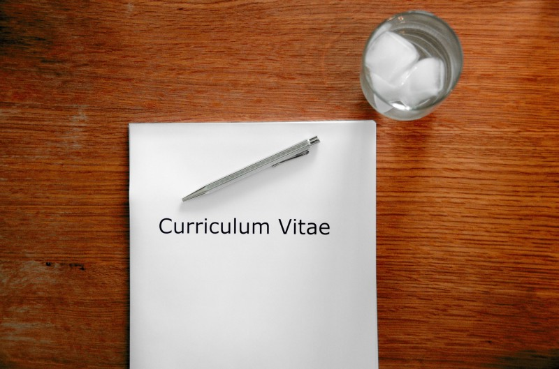

### **Intro**

My name is Artjoms and I’m an iOS developer at [Pipedrive](https://www.pipedrive.com/en/jobs) and [DevTernity](https://devternity.com?r=Y2NyYXp5Lmpqb2VAZ21haWwuY29t) conference organiser. I have moved to Estonia recently and want to share my journey in a series of small posts.

There are already lots of relocation guides about moving to Estonia or any other country out there, which I, of course, used a lot in my relocation process. They usually focus more on practical relocation aspect, which is really nice and useful. But what I wanted to describe here is how my relocation process went on, while facing pure introvert problems, trying to share some of my findings and practices I have discovered during this life changing journey.

You will find some useful and practical information about moving to Estonia here as well, but mostly I will try to focus on introvert aspects more and how to deal with them during relocation.

### Getting out of your bubble

You know you’re in trouble when your perfectly handcrafted [introvert bubble](http://www.huffingtonpost.com/2014/10/16/understanding-introverts-_n_5989656.html) suddenly faces the relocation, which usually means new people, new locations, new routines and lots of communication involved.

Being a “professional” introvert myself, I invested a lot in polishing my own bubble that kept me alive for a long time, and it was a big surprise for me how painful it is to break away from your established routines and behaviors, — something that you will have to do to for sure if you are relocating.

> _Be ready to crack your “introvert bubble”, even if it’s perfectly crafted_

First of all, you must realize that your internal introvert will have to suffer a lot during the nearest time. This is not a bad thing, of course, but it might be hard to start. Believe me, you will become much stronger after this. It’s always hard to crack the shell, especially when it’s pretty strong. Prepare to talk a lot, meet lots of people face to face and make an impression. It might be something you tried to avoid, but you won’t reach far without it.

If you have realized what will follow, it will be much easier for you from now. There will be issues to resolve, problems to face and stress to deal with. But that’s something that makes our life interesting if managed properly. And you will learn precious lessons during this time that will help you in the future for sure.

### Recharging

To keep on track during the upcoming adventure, find a proper way to recharge yourself in a short time. Usually, I needed 1–2 days spent in isolation to recharge after meeting a lot of people and communicating with them. It’s too much and won’t work if you are trying to get out of your comfort zone! Be prepared that you will have to communicate a lot and you won’t have so much time.

What I found useful is meditation combined with short but intensive exercises. I have practiced meditation before time after time but didn’t take it seriously and it wasn’t something systematical for me. When I faced the relocation, I started meditating regularly and even in a limited period it helped me to stay focused, less stressed and I found out that it can help you recharge much faster. Especially when mixed with physical activity.

> _Huge advantage of meditation is that it can be done literally everywhere_

I use [Calm](https://itunes.apple.com/us/app/calm-meditation-to-relax-focus-sleep-better/id571800810?mt=8) app for my meditation sessions, [Scientific 7-minute workout](https://well.blogs.nytimes.com/projects/workouts/) for workouts and [Things3](https://culturedcode.com/things/) (_redacted in 2019_) to track everyday progress and remind me when I have to recharge. This combination is also useful if you’re not relocating, of course, and can improve the quality of your daily life.

I won’t dive deeper into explaining meditation — you can read about it literally everywhere nowadays. But it’s better just to try it once to understand — [Calm](https://itunes.apple.com/us/app/calm-meditation-to-relax-focus-sleep-better/id571800810?mt=8) or [Headspace](https://itunes.apple.com/us/app/headspace-guided-meditation/id493145008?mt=8) apps have guided one-week courses that will explain the basics. And it won’t take more than 10 minutes of your time per day. Neat!

### Preparing for interviews

Now when you are mentally ready to face what is coming, let’s move on to the first and the most important step — finding a job! Going to interviews while being an introvert is hard. You have to practice not to look like a [confused cat](http://gph.is/18XyBkW) while you are being interviewed, so my advice here is to… practice!

Even if you have a decent job right now in your city, just send your CV to several companies (both local and abroad, why not?) and pay a visit or join remotely to have a small talk with them. Not only this will allow you to know your price and overall market situation better, as well as understand what skills are trending at the moment, but you will also receive a decent boost in your confidence and get a valuable practice and connections. Each new interview will be easier to attend, believe me. Try to attend at least one interview in few months.

> _Attending interviews regularly will also force you to have your CV up to date all the time!_

This works great especially if you are not searching for a job right now, as you don’t have any expectations and dependencies on the outcome. After the n-th interview, you will realize that being an introvert and shy person shouldn’t be a problem during interviews, especially if you are being yourself during the conversations and don’t hide the fact of your true internal nature.

### Facing the interviews

My interview experience in Pipedrive was the most intensive one I have experienced so far. If you are interested, the whole process has already been described [before](https://medium.com/@cvbk/how-i-got-my-brilliant-new-job-2e8c4ffb3f76).

I have faced an extensive full-day interview cycle, without being able to meditate or isolate myself between the sessions. You should be prepared to something like this when you are traveling to another country for the interviews — it’s a common practice to save time and make the process more optimised both for a company and potential employee.

I would advise here to get a decent sleep before and to stay hydrated all the time. Be honest and don’t act as a person you’re truly not. Don’t be shy to say that you need a break when you need it and ask for a short rest when you need to. Meditating before interviews helps a lot to reduce stress levels and clear your mind.

### Making a decision

So you made it through the interviews and got an offer. Now it’s time to face a really important moment in your life — making a decision.

From one side, you know what you already have. A city you live in and used to, a job (maybe even a decent and stable one), perfectly crafted routines and all that stuff. On the other hand, you are being offered to relocate to somewhere else, where you literally will have to start from scratch. Most probably you already realize all the potential problems you will be facing. Your introvert bubble shrinks a bit in fear, making it harder to decide — comfort vs. adventure.

> _Sooner or later, you will have to face game-changing decisions in your life. Be brave!_

Of course, you have to weigh out your decision, taking all the circumstances and your current life situation into account. For me, one of the main motivations and reasons to move on was that it seemed stupid to me to refuse this adventure life has offered me. So be brave and accept the offer. Especially when you have gone so far. [JUST DO IT...](https://www.youtube.com/watch?v=ZXsQAXx_ao0)

### Dealing with it

… and deal with it!

In the [next blog post](/moving-to-estonia-for-introverts-2), I describe how I prepared for the relocation and tried (not always successfully) to manage the stress caused by my decision.
