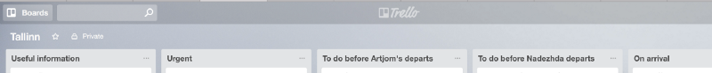

### Reality

In my [previous](/moving-to-estonia-for-introverts-1) post I wrote about the importance of having a proper way to recharge yourself and stabilize your feelings while going through interview and relocation processes.   
That sounded good and quite easy, right?

But here is the fact — as you will accept the offer and dive into preparation tasks, most probably you will go nuts, sooner or later. I have to admit that amount of stress is huge, especially if there was no previous relocation experience. Even those fancy recharging methods might not help unless you can afford to spend 8 hours per day on meditation.

This time I will share my experience and problems I faced while preparing for relocation.

### Timeframe

As I was employed at the moment decision was made, it was required to work at least for a month in my current position before leaving, according to Latvian law. [Pipedrive](https://www.pipedrive.com/en/jobs) offered two start date options and I have decided to give myself some extra time in Estonia to find an apartment and settle in. You will be able to read about it in the upcoming blog post.

So, in the end, I had one month of ongoing duties and two extra weeks for relocation and settling in. This actually meant that I had a limited and pretty busy time frame to prepare.

> _Time is the most valuable resource we all have. Use it wisely. Not only when you are relocating, but every day!_

You must stay organized during this period and use your time effectively! This applies to the whole life itself as well, by the way : )

### Staying organized

The first thing that you should do to reduce the amount of stress is to create a proper to-do list with all the tasks you have to complete. I don’t recommend doing it on paper (unless you setup [Kanban board](https://en.wikipedia.org/wiki/Kanban_board) in your room). You can use [Trello](https://trello.com) for this.

In my daily life, I use Trello a lot. Studies, weekly and monthly routines, meetup and [conference](http://devternity.com) organization, work. It’s free, flexible and oh boy, it feels soo good to move one of the tasks to the Done stage! Give it a try. Oh, and did you know that can use [Pipedrive](https://www.pipedrive.com) for this as well?

> _Just a small example of how it’s possible to set up your board._

My advice is to attach any possible documents to the cards and store relocation-related information in Trello board as well. E.g. I had relocation guide attached to one of the cards in “Useful information” to be able to check it anywhere, even on my phone.

Being introvert taught me to document and categorize any information I find potentially useful to avoid unneeded conversations in the future. It’s good to have all the info stored in one place, and tools like Trello and Pipedrive come in handy. Don’t be lazy and spend few minutes to store any piece of convenient information you get — it might save time in the future!

### Communication

I won’t be diving too deep inside preparations process — experience may vary for everyone, of course. But sooner or later you will discover that there are multiple questions that you want to be answered before you leave — in my case, it was related with moving my car to Estonia, and, the most important one, — my wife. She has no EU citizenship which makes it much harder to relocate for her.

First of all — don’t panic. There are plenty of [resources](https://www.workinestonia.com/) and [guides](http://vm.ee/sites/default/files/content-editors/Destination_Estonia-Relocation%20Guide.pdf) that will get you covered in most cases. The digital world turned our life into introvert heaven — you can get almost all your answers online!

> _You can solve the majority of your relocation problems while enjoying your coffee. Thanks, Internet!_

Estonians are known for their praise of technology, so in case you can’t find answers online, drop them an email. And get some patience — you won’t get your answer as fast as you probably would like to. But when it comes, it will be polite and detailed. English is commonly used in Estonia for digital communication and even government institutions will be able to answer you. Russian is an option as well, but I would suggest using English as a bigger amount of people know it. All government-related institutions have their own website, which usually is translated to Estonian, English and in most case Russian as well.

As I mentioned before, most probably you won’t get your email answered fast. If you are out of time, it’s better to call. In most cases, you will be able to get your answers in English or Russian. Again, you should be prepared to crack that shell — being on the phone is just one of the several challenges you will face as an introvert!

### When it all goes nuts

So time keeps rolling, you have everything under control, — emails sent, information is being gathered. You are meditating regularly and it all looks good, until one day you realize that something is completely wrong.

You start feeling that it’s impossible to handle the relocation, that you will miss some particular people too much, and all other stuff that your stressed mind will throw right at you. For me, that happened about a week before I had to move.

Don’t let this consume you! First of all, this is a natural human reaction — to resist any upcoming change. Relocation is a huge one, and one part of your brain will try to keep you out of this by creating all those nasty thoughts.

When you understand that you are about to reach this undesired condition, you should take a pause. Realise that you have everything under control, take a day off and do something that you usually do to recharge your inner introvert. Try to avoid any thoughts about what is waiting for you. Don’t check emails and turn off your phone as well.

> _You can guess what I did that day : )_

One day can’t make a big difference for relocation process, especially if you have everything organized and you were not slacking from the start of the process. But it will make a huge difference for YOU, I promise!

### Packing

Packing your stuff might be a challenge as well. Once again, this really depends on your current location and situation. I will just give you some ideas that might make your packing process easier a bit.

First of all, you should plan your packing for few last days. Don’t do this earlier — this will put you under stress even more. Don’t postpone any other urgent tasks until that period.

Second, you don’t need this thing! And this. But what about that thing? [NO](http://gph.is/1maiw0M)! People usually overrate the amount of clothes and items they need for their daily life. Be minimalistic. Take only what you really need — you can buy other stuff later when you have already moved in. You will start realizing what you are really missing in your daily life step by step.

I’m pretty sure you don’t need this old tire in your life. Then why would you need all that trash you decided to take with you?

So — take the minimum of your stuff and buy everything you need later. You will be surprised about a number of your precious belongings that you will never miss.

### Preparing for long trips

And now, the time has come. You get in the car/bus/train/plane and start your journey to the new life. If you are traveling a lot, most probably you are well-prepared for this already. Have a safe trip!

But for those who have less experience in this, I would recommend making some basic preparations that will make your trip easier. First — grab some books or audiobooks with you. Music is great and you should have it available for offline listening as well, but having a book with you will help to be distracted and avoid bad thoughts during the trip. Besides making you a smarter person, of course!

> _Reading is a great and useful distraction. Your mind won’t have time to panic while you are reading!_

Don’t forget to download offline maps for the area you will arrive to — Estonia is a small country and it won’t take too much disk space, but might come in handy. Use Google Maps’ offline feature or [maps.me](http://maps.me) for this. I would also suggest downloading offline Estonian-Ensligh translations just in case.

### Settling in

[Next blog post](https://medium.com/@artjoms.haleckis/moving-to-estonia-guide-for-introverts-part-3-70f5c40ace9c) covers settling in process, apartment renting and first baby steps after relocating.
