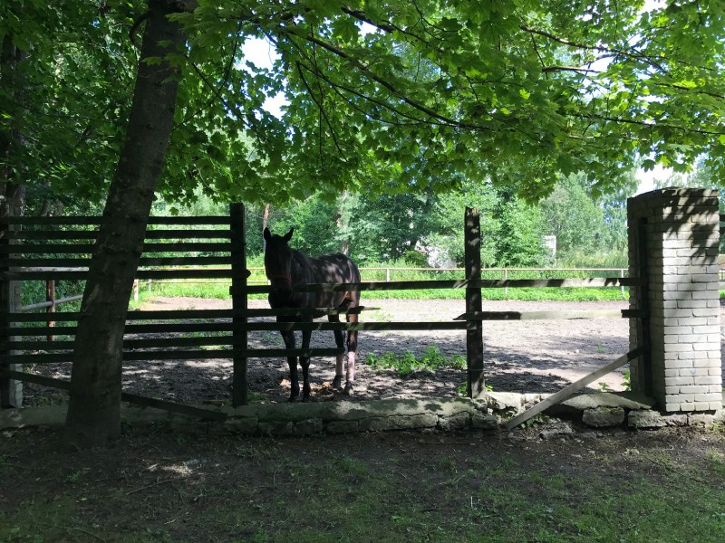
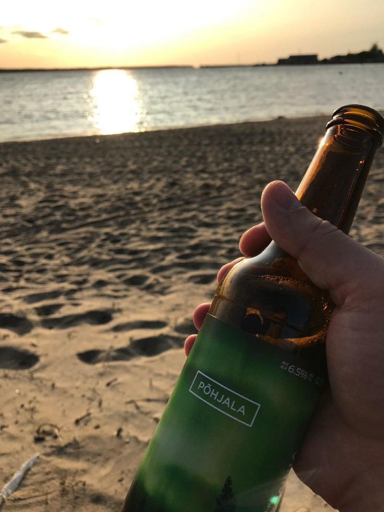
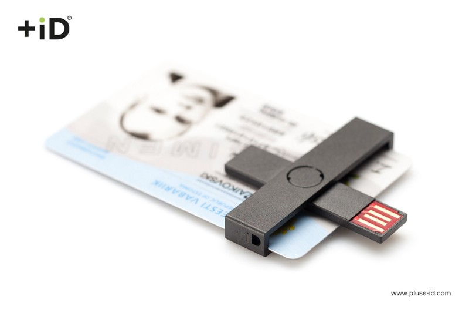
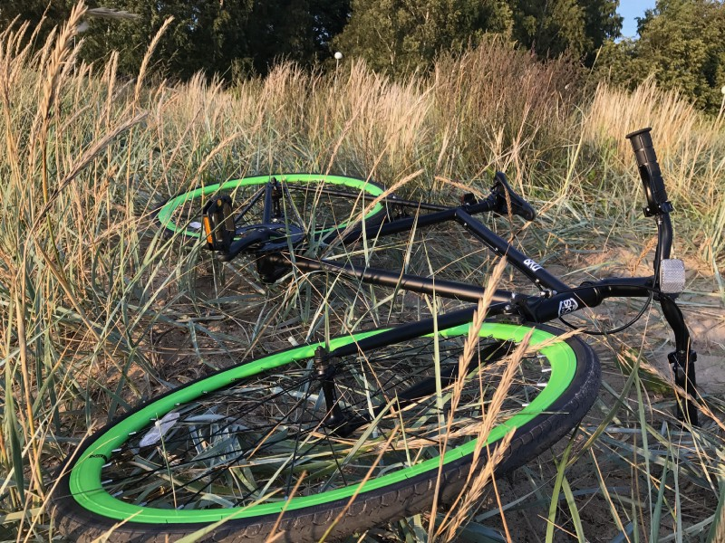

### So this is it

In part [one](/moving-to-estonia-for-introverts-1) and [two](/moving-to-estonia-for-introverts-2) I have described both mental and physical preparation processes that I went through during my journey to become [Pipedrive](https://www.pipedrive.com/en/jobs) team member and Estonian resident. It was an interesting time to learn a lot about myself, especially my fears, unexpected addictions to particular people and how to deal with them, and how person’s mind works in general.

This time I want to share a more practical side of the relocation — what you need to do upon the arrival, how to plan your time better, settle in and not go nuts.

### Stressless arrival and first days

Simply arriving at any country obviously doesn’t count as complete relocation. You have to solve a series of problems before you can grab that beer and take a “victory” sip. The sooner you realize that the better. As an introvert, most probably you will face another series of stress and you better be prepared.

> _Reducing stress is the key. Find your own way and you will prosper._

Once again, meditation was a life savior for me. Even upon the arrival, I continued meditating every day. This allowed me to stay focused, aware and patient. Don’t let relocation-related stress to consume you — now is the most crucial time to be productive and calm at the same time! Even though time is limited, you still have to relax and spend some resources on recharging, so do something that helps you with it.

Also, consider next advice as a possible nerve-saving solution.

### Worst-case scenario approach

Even though I’m not a huge fan of Dale Carnegie and his books, “[How to Stop Worrying and Start Living](https://www.goodreads.com/book/show/4866.How_to_Stop_Worrying_and_Start_Living)” had a great mind trickidea that I have adopted a long time ago at school, but didn’t realize I’ve been using it till I read the book. It’s called “worst-case scenario approach”. The idea is simple — you imagine the worst-case scenario any situation that you are worried about can end up with, accept it in advance and act!

> _This might sound a bit pessimistic but works great for people with the particular mindset._

I have used it a lot during relocation, flat hunt and early adaptation period. Simply visualizing what could be the worst outcome of any particular task or problem, I convinced myself that I shouldn’t worry so much, as I was already prepared for the worst. Then, I simply had to act accordingly. Usually, this works in a way that the bad scenario doesn’t happen at all, but you are already a way ahead of the problem, and the outcome is either absolutely satisfying or you are ready to move on. Try it!

### District scouting and temporary apartment

Most probably you will have to rent a temporary apartment upon the arrival. For me that was the most important first task — time was limited to the job start and having a proper place to live meant that I can go on with less worries.

Choosing a district to live is the first thing that should be done. I was lucky to have a proper district recommendations in relocation guide that Pipedrive has provided, but it’s [possible](http://www.tallinn.ee/eng/districts) to find this information other ways as well.

Study districts before you leave. Take your time to analyze infrastructure, use Google Maps’ Street View to have a virtual tour around the neighborhood and choose one or two districts you think could be suitable for you. Besides, I would recommend having few more as a backup.

Tallinn has 8 main districts and even though city itself is pretty small, they are all pretty diverse in terms of both experiences you get there, as well as prices.

> _Advice of the day — don’t look at any renting advertisement before you have arrived. You won’t be able to rent out remotely anyway and it will be sad to see what precious places you have potentially missed. Don’t rush!_

The last step — rent Airbnb apartment in the most desired district. As mentioned previously, I had two weeks before the job started, so I had to live somewhere anyway. Having a chance to experience living in your probable future district is a great way to fully understand if you want to commit to staying there for a longer time. Besides, it will make scheduling visits to apartments you are willing to rent easier.

For me, the pretty obvious choice was Põhja-Tallinn (also known as Northern Tallinn) district. 10-minute walk to the sea with parks and promenade nearby, 25-minute walk (or 5-minute drive) to the office, and it’s not far away from [Telliskivi](http://telliskivi.eu/en/) — local hipster heaven with bars, tasty food, and entertainments.

> _Also, there are lots of horses in the neighborhood ❤_

The last thing to mention — double-check if the apartment you are renting has a proper Internet connection. I was unlucky to have 500Kbs internet in my [Airbnb on Ristiku street](https://www.airbnb.com/rooms/19798832) and it was a pain to be productive in the flat hunt.

### Flat hunt

You have arrived at your district, grabbed some great local craft beer and spent an hour to chill. Now it’s time for a hunt!

There are [good guides](https://medium.com/@lekskazimirchuk/how-to-rent-an-apartment-in-tallinn-for-dummies-45f190d1ae3c) about renting a flat already available that I find very useful. If you follow the advice there, you will have a stress-free hunting process. But there are still a few things to keep in mind.

While Being small, Tallinn attracts a lot of nomads, and that leads to high rental flats demand. Prices are skyrocketing during last years, which leads to the situation when you can see some absurd options for ridiculous prices. Don’t let this distract you! There are good options available, you just have to be patient and filter out silly offers.

I used [kv.ee](http://www.kv.ee) and [City24](https://www.city24.ee) as the main source of available flats, but you should take in account that they are usually are rented by brokers and you will have to pay them a huge fee equal to one-month rent price. In exchange though, you will get proper and clear communication in Estonian, English and in most cases Russian. There are also other options available, e.g. Facebook groups ([1](https://www.facebook.com/groups/166477880066544/) or [2](https://www.facebook.com/groups/1395659303995885)) for nomads, or even special [websites for zero broker fee flats](https://www.nobroker.ee). They tend to have some interesting options, but you have to react fast and there are some risks involved, of course.

You might be surprised that new offers are appearing very slowly (e.g. on a second day I found only 2–3 new offers in my district) — Tallinn is a small city. In case you get no promising results, don’t panic — if you followed my advice, you have backup districts options prepared. Add them to your search filters on the second or third day — not only this will increase your chances to find a new flat faster, but also will boost your mood as you will have a set of new options to work with.

### Signing renting agreement and further steps

There is a big chance that you don’t know Estonian yet, obviously. Law doesn’t require renting agreements to be translated, so in some cases, you might end up with the agreement you can’t understand. Try to avoid this situation — even though it’s good to trust in humanity, you are going to sign a paper that will oblige you to do to something for at least a year or even more. Better to be informed.

For this, using brokers usually helps, as good ones try to provide agreement both in Estonian and English. Ask to send agreement in advance so that you have enough time to read it properly (otherwise you will end up with putting your signature in panic while others are staring at you and might miss something). Don’t forget to re-read agreement before signing. This helped me because even though we agreed to sign for 1 year, the paper mentioned 5 years (as they explained, “a typo”). So be careful, be prepared in advance and don’t rush.

> _Agreement signed. It’s awesome beer time! You deserve it!_

After you have the agreement, you have to [register your place of residence](https://www.workinestonia.com/coming-to-estonia/registering-place-of-residence/). The process is relatively easy and straightforward and involves minimum bureaucracy (just filling in one paper). You will get notified of the status via e-mail. Also, they automatically provide residence information to the Police, which is also your next stop.

### ID Card

Getting Estonian [ID card](https://e-estonia.com/solutions/e-identity/id-card/) is the last thing that you have to do to feel comfortable. It’s widely used — for logins, digital signatures, prescription medicine and even voting. Also, as soon as you have it together with the registered place of residence in Tallinn, you get free public transport!  
To retrieve it, simply visit [this page](https://www.politsei.ee/en/kontakt/kmb/index.dot) and find the closest service point. You don’t have to pre-register, just go there and you will be provided with further steps. Then, in a weeks or two, you will have to go there again and grab your card.

> _Don’t forget to buy card reader from electronics store!_

As soon as you have the ID card, I would recommend going to the bank to open a new account. Without the ID it might take a while and process is harder, so the best way is to do it as soon as you have the document.

### Road ahead

Of course, there is much more to do upon the arrival — opening the bank account, buying all the required goods, sorting out driving license and car — related issues, but as soon as you have the basics covered, you can take your time.

I strongly recommend going through [WorkInEstonia](https://www.workinestonia.com/coming-to-estonia/) questionnaire to get the full list of required steps.

And grab a bike! I was able to discover the city in a pleasant and healthy way in no time.

Happy relocating!
