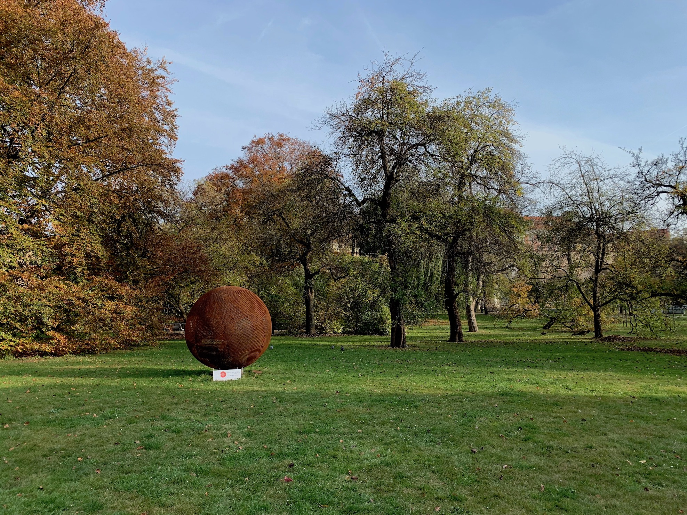
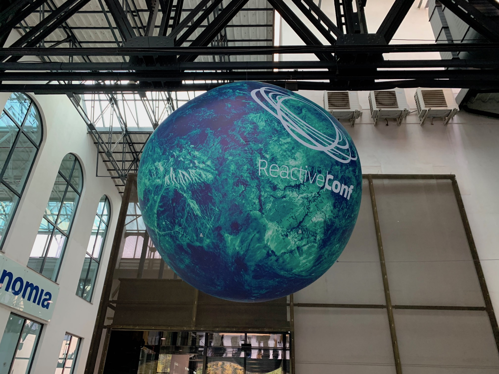
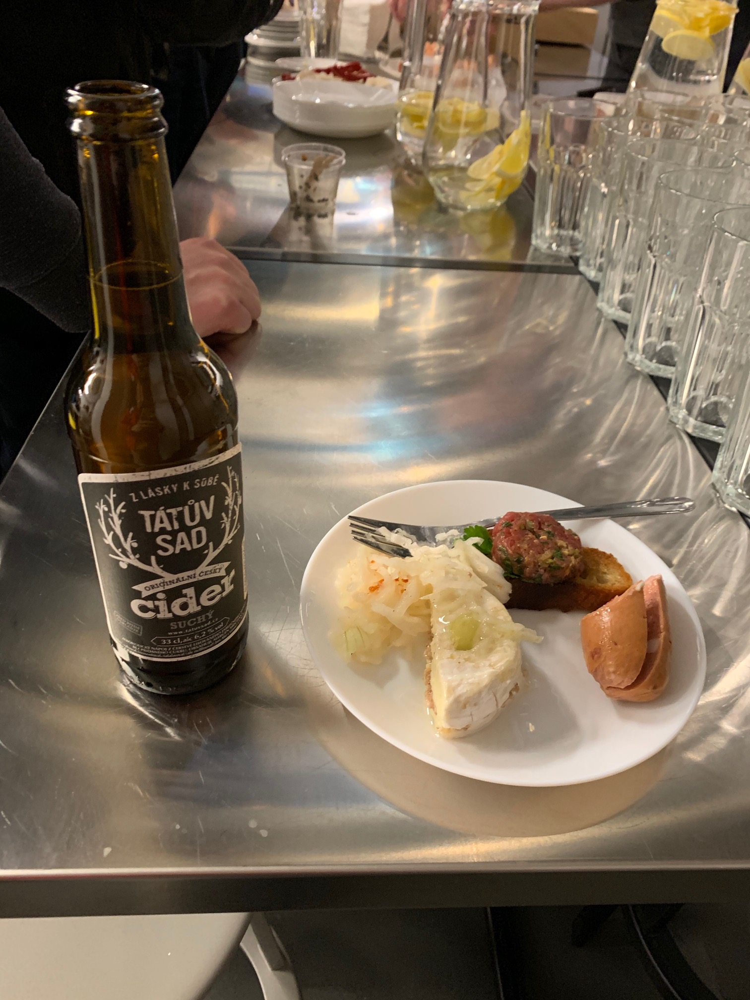

During my [last year's visit to UIKonf in Berlin](/uikonf-2018-conference-review) as an iOS developer, I couldn't imagine myself writing this kind of post in just a year, to be honest.
The reason of the shift and how it happened is a separate topic that I probably will cover later, but in short, since getting iOS-fatigue and being disappointed by the way Apple operates lately and the state of development for iOS in general, I took a chance to be on of the first members of [Pipedrive](https://www.pipedrive.com/en/jobs) React Native team. Since then, my interest in JS and React world is constantly growing.

And that's how I ended up in Prague this year for a [ReactiveConf](https://reactiveconf.com/) 5th edition.

### City

ReactiveConf is happening has been created and is organized in the Czech Republic, Prague.
Prague is one of the top attractions for tourists in Europe, mostly due to a well-preserved old town, castle, historic buildings, and beer culture, of course.
While this being a good benefit for the economy in general, I would say that the number of tourists was too much for me. It was my second time in this city, and I wasn't able to enjoy it simply because of the endless and constant tourist flow all over the place.
Despite that, Prague is a nice place to have a long walk with some great views, and it’s even possible to find quiet places to enjoy historical vibes.

> _I somehow discovered completely empty park in the middle of overcrowded old town and spent some time there to recharge_

### Venue

Forum Karlin is a modern venue for concerts and large events located in Karlín district. It's relatively close to the city center by the Prague scale and is located in a nice neighborhood.
It was a very comfortable and pleasant place to be in these days - enough of space for everyone - two stages, speakers, 1300+ visitors, catering and the whole crew.
I liked how sponsors' stands were joined with the main stage - located by perimeter and making the whole location feel more alive at any time. It also freed up corridors and other locations like hall, making more space for visitors to feel comfortable. This also created a feeling that sponsors are the real part of the event, not a rudimental activity that one can attend during a short break.

> _Conference entrance. Overall decoration and theme was great!_

### Activities

Any conference is all about networking and discovering new people. One of the best ways of doing this is by attending various activities provided by conference organizers and local companies. ReactiveConf had a decent selection of those. I enjoyed that the majority of them were built around learning more about Prague and combined a lot of walking and visiting local hidden gems.
Pipedrive’s Prague office (it’s also a company I work in right now but in Tallin) had many different sightseeing tours, so I joined one of them to see Prague Castle and enjoy local beers.

It all ended in the Pipedrive office with beers, pizza, and quiz. I really enjoyed how this was organized and atmosphere and vibe during office after-party were awesome!

> _Pipedrive afterparty served local food and drinks <3_

### Content

I'm notably new to Javascript and all the topics around it. My main purpose in visiting the conference this year was to get an understanding of the problems JS developers are facing these days and to get some inspiration and self-development vectors. I believe both targets were achieved thanks to the distinct selection of talks for all skill levels and technologies.
Talks were organized by two parallel tracks, with main (Millenium) track being the largest and suited mostly for generic or entry-level topics, as well as some inspirational talks, and second (Discovery) devoted to more advanced and deep topics.
I really like this approach because it allowed me to spend the majority of my time at the first stage and not feeling that I'm missing something or making a wrong choice.
The percentage of topics that made me bored or lost my attention was really low in the end, which is pretty rare for conferences with a mix of different range of topics.
I was able to discover that on a high level, JS developers are dealing with the same issues as any other developers nowadays: testing, performance, adopting new solutions while staying a sane person, etc.
I got insights on a lot of cool technologies and ideas, and got motivated by the community and work it does in general.

Here is my list of TOP-5 talks in no particular order:

- [**Matthew Gerstman** - TypeScript: Seeing Past the Hype](https://www.youtube.com/watch?v=KdvEGPiULAQ)

- [**Necoline Hubner** - Resiliency and PWAs](https://www.youtube.com/watch?v=KykVhf6vaVk)

- [**Gil Tayar** - Don’t Believe the Rumors: Writing Tests for CSS is Possible](https://www.youtube.com/watch?v=3EJaforaVkA)

- [**Richard Feldman** - Predicting the Future of the Web](https://www.youtube.com/watch?v=okrB3aJtUaw)

- [**Gleb Bahmutov: Cypress.io** – the State of the Art End-to-end Testing Tool](https://www.youtube.com/watch?v=JL3QKQO80fs)

One of the really cool achievements of the team was that all videos were available in 1(!!) day after the conference. Usually, it takes some time (and some conferences even don’t share videos on purpose for a longer period, which I consider extremely bad practice). It’s possible to check other videos [here](https://www.youtube.com/playlist?list=PLa2ZZ09WYepO3McQsvnZy1fvA18YSU7_v).

### People

Of course, providing quality content, activities and interesting sponsors is on the organizers’ side of the conference. The vibe and overall atmosphere is something only visitors can mostly create. It somehow felt that attendees were pretty inactive this year. Energy level often was really low, interaction with speakers and host were mostly forced and this created a feeling that the majority of visitors are not fully involved in what is happening. The same feeling remained during the second day as well. I guess that the huge venue is one of the causes for this kind of atmosphere, because the second, much smaller stage, was rather energetic and had this cozy meetup feeling. I don’t really know if there is any real solution for this besides software developers becoming a bit more proactive.
Anyway, I had a few really nice chats during the conference, and everyone was friendly, so the overall impression is inclined towards good rather than bad.

### Conclusion

I used to [help organize a meetup and a large conference](/how-organizing-meetup-changed-my-life), so I know by experience what kind of hard work it is and what is the amount of problems being solved that visitors usually are not even aware of. When looking at the scale of ReactiveConf and the size of a team, I can only imagine how hard they worked to make it happen. Even such a delicate topic as catering has been handled extremely well. Also, it was a pleasant surprise to see that organizers [team](https://reactiveconf.com/contact/) is mostly female <3
I got a nice motivation boost, met new people and discovered a lot of new tools and ideas, which means that ReactiveConf 2019 was a success!
