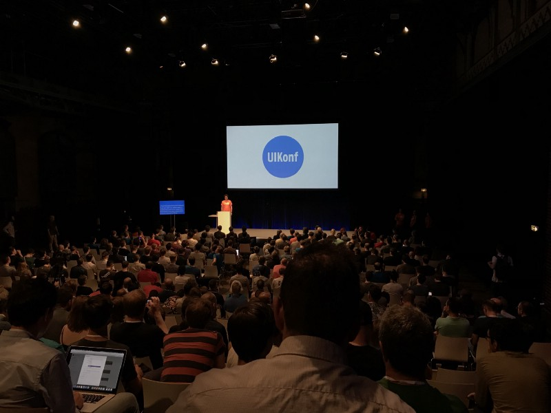
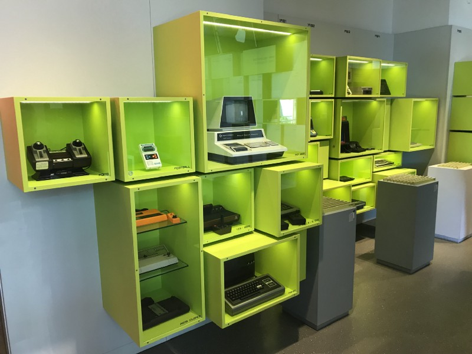
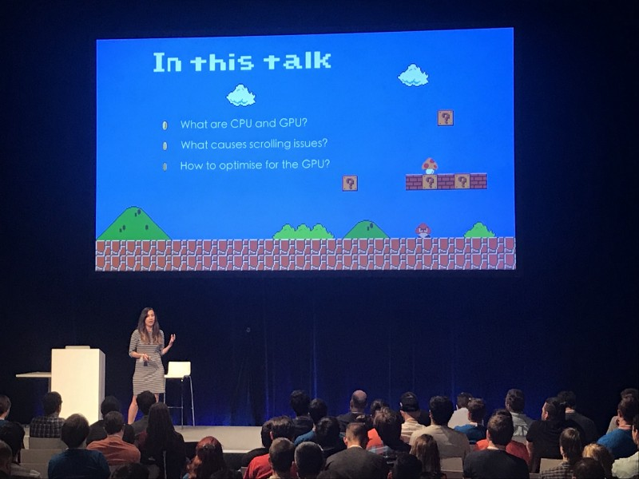

Attending conferences is an important part of being a software developer nowadays. Not only it’s a great way of educating yourself about particular topics, it’s also a chance to establish new connections and meet the community you are part of.

This year I was lucky to attend one of the biggest iOS-related conferences in Europe — [UIKonf](http://www.uikonf.com).

### City

For the 6th year, UIKonf is happening in Berlin. Located in the middle of Europe, it’s an accessible location for anyone.

Berlin itself is a really diverse city, offering any kind of attractions and leisure time activities. It has its unique vibe and interesting past which the city has evolved upon. Make sure you book a few more days to explore the city and what it has to offer!

While being called a diverse city, I was amazed that English can be not enough to feel comfortable in Berlin, especially if you diverge from regular tourist routes, which I usually prefer to do right away. Also, Berlin isn’t really credit-card friendly, so grab some cash with you, otherwise small business owners might very upset or even won’t be able to provide their services.

> _Don’t forget to try famous Currywurst!_

By any other means, Berlin is a great city to visit as a tourist, especially during spring, when the weather is sunny and you can rent a bike.

The city is bike-friendly and I would say that it’s the best commuting way during the conference days — it’s cheap and it’s easy to rent one by using an [app](https://www.donkey.bike).

### Venue

This year UIKonf was happening in [Radialsystem V](https://radialsystem.de). The venue is not far away from city center and for me, it was a perfect one for the event. There was enough space for everyone inside, it had a large hall for sponsors and catering, and huge open-air zone with benches and tables to chill during the break and get a lunch.

> _Presentations were easy to see, and even live speech-to-text was available!_

### Activities

First day activities is an important part of UIKonf. It’s possible to choose between a variety of things to do in Berlin at the first day, and it’s paid by your conference ticket. It includes bike tour, boat tour, bus tour, brewery visit, computer games museum and others. This is a chance to meet new people with the same interests (besides iOS of course) and get to know Berlin better.  
Afterwards, everyone could join a pre-party to get a badge, swag, and free drinks.

> _It’s not hard to guess where did I go!_

After 2 days of talks, unconference event offers a playground for attendees to share their ideas, code together, as well as attend optional workshops.

### Catering

As a [conference](https://devternity.com) ex-organizer myself, I know the struggles of providing a proper catering for such a huge crowd and ensuring that everyone is happy.

UIKonf offered vegetarian-only dishes, with gluten-free and lactose-free options. I think this is much better than a regular meat/vegetarian separation, being gluten- and lactose-intolerant myself. Everyone can eat a tasty vegetarian food, given it’s a proper one and provides the same nutrition value. Food intolerance is something that is not treated properly these days in the majority of the events and catering places, so I was surprised to see this kind of attention.

Food was great, and UIKonf gets a huge score for how it was organized!

### Content

While all the things I described before are important, talk content is the most valuable thing, of course. That’s the reason we travel from all over the world to gather under one roof. Usually talks in conferences like this shape the community and even define trends for the upcoming years.

This year wasn’t an exception. As usual, UIKonf provided balanced talks, ranging from completely non-technical to super low-compiler-level talks, each (well, almost each, honestly saying) providing great takeaways and brain food.

> _Video game and book references all over the place ❤_

There was only 1 track, so I was able to attend all the talks. I find this model good for single technology-focused conferences, while 2–3 track approach works better for more generic ones.

As always, there were highlights that inspired or educated me the most, here is my TOP-5 list in no particular order:

- [**Peter Steinberger** — Building Personal Brands for Introverts](https://www.youtube.com/watch?v=0c6izSzP-KQ)
- [**Dave DeLong** — The Laws of Magic](https://www.youtube.com/watch?v=gx9ywSNm1jM)
- [**Vincent Garrigues** — Scaling iOS, a story of technical debt, and how to get through it](https://www.youtube.com/watch?v=fmzA7cLyKv0)
- [**Adrian Kosmaczewski** — A Decade of iPhone & iOS in 40 minutes](https://www.youtube.com/watch?v=Kka8J9f53XA)
- [**Anastasia Voitova** — 10 Things you Need to Know before Implementing Cryptography](https://www.youtube.com/watch?v=_fKR-KZ4yJQ)

[Other talks](https://www.youtube.com/watch?v=Nx0cKEQcbz4&list=PLdr22uU_wISohI7PIhzq0gotGfKZl1lGo) were (mostly) great and valuable as well and I totally recommend watching (mostly) all of them online!

### People

I always knew that iOS community is awesome! But experiencing it offline rather than online is the next level. I was amazed at the overall vibes of the crowd. Those people love Apple. Those people love software development. Those people are amazing engineers. And those people gathered all together to learn and share!

Everyone was friendly and eager to chat. What I particularly like about the events like this is that it’s possible to meet rockstars and realize that they are regular people. Have a lunch together with [Ole Begemann](https://twitter.com/olebegemann) while chatting casually about life in Berlin? Why not!

### Key takeaways

- This year, several talks mentioned about us, software developers, making an impact on the world, including other people, politics, and environment. I like that this is discussed a lot recently, especially since modern social media is built around diving people into categories that hate each other. We have power and tools to change that!
- Eliminating toxicity in your daily online and offline life is important. Being positive person is important. Instead of ranting about something online, propose a solution or contribute to investigating, if one exists. Instead of consuming mindlessly endless streams of useless content, invest your time into creating valuable one in terms of blog/talk/podcast.
- App architecture becomes a less hot topic, it seems. Everyone is already tired of inventing their own, and it feels that people start to understand that overcomplicated architectures are also bad, so we are talking about simplification and learning to use MVC properly. VIPER still confuses people, even if you try to simplify it 🤯. I liked the talk by Susmita Horrow, however. It showed the power of generics and how boilerplate code can be eliminated easily.
- Testing and debugging is still hot and important. Apple has lots of native tools that can make our life easier, they mostly work great and we should stick to them when possible before considering an alternative 3rd party.
- Scrolling performance is a neverending story and the source of endless talks. I hope Apple will just introduce a separate CPU unit for Autolayout calculations and we will close this topic forever 🙈.
- 🦊 Security, security, security! (and cats 🐱!)
- Making mistakes allows you to learn more. Always understand what and why happened and learn from it. Don’t create a culture that punishes people for mistakes and doesn’t allow you to grow because of that.
- It’s possible to tell a full story of iOS and iPhone history in 40 minutes and show at least 10 slides with Marvel movies at the same time.

### Conclusion

UIKonf is ❤! It’s a four-day, extremely well-organized conference, packed with positive people and educating talks. I will definitely attend next year and I totally recommend it to everyone from the iOS world!
